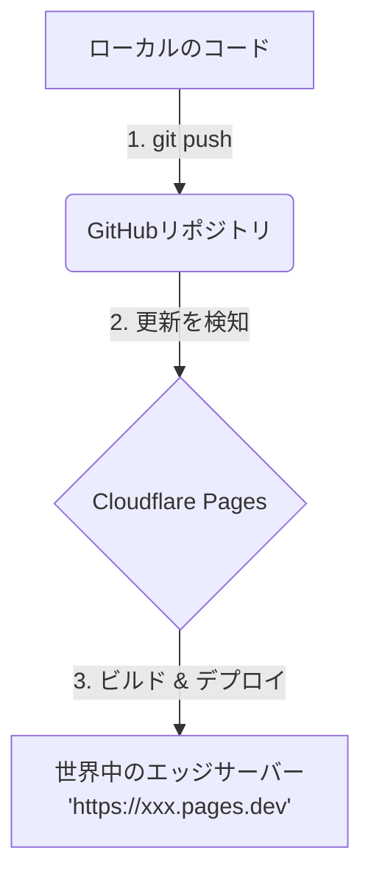

# プロジェクト ①: サイト公開フローガイド

このドキュメントでは、GitHubとCloudflare Pagesを使用してウェブサイトを公開する際の流れを説明します。

## 🔄 公開の全体像

以下の図は、開発から公開までの自動化されたパイプラインを示しています。

---

## 📅 ステップバイステップの手順

### 1. バージョン管理 (GitHub)
- **コードの保管**: ウェブサイトのファイル（HTML, CSS, JS）はすべてGitHubリポジトリに保存されます。
- **変更履歴**: すべての変更が記録されるため、何か問題が起きても過去の状態にすぐ戻すことが可能です。

### 2. 連携 (GitHub ↔ Cloudflare)
- CloudflareアカウントをGitHubリポジトリと紐付けます。これにより、Cloudflareがリポジトリの更新を常時「監視」するようになります。

### 3. 自動デプロイ
- **トリガー**: 新しいコードをGitHubにアップロード（プッシュ）すると、Cloudflareが即座にそれを検知します。
- **プロセス**: Cloudflareが自動的に最新のコードを取得し、世界中のネットワークに配信します。
- **結果**: サーバーを手動で操作することなく、数秒でサイトが世界中に公開・更新されます。

---

## 🚀 プロフェッショナルが利用するメリット

| 機能 | メリット |
| :--- | :--- |
| **維持費 0 円** | 静的サイトの場合、Cloudflare Pagesは無料で利用可能です。 |
| **高いセキュリティ** | 管理すべきサーバーがないため、ハッキングのリスクが極めて低くなります。 |
| **世界最速級の配信** | 世界300拠点以上の拠点から配信されるため、どこからアクセスしても爆速で表示されます。 |
| **効率的な運用** | サイトの文言修正なども、ファイルを保存してGitHubに送るだけで完了します。 |
